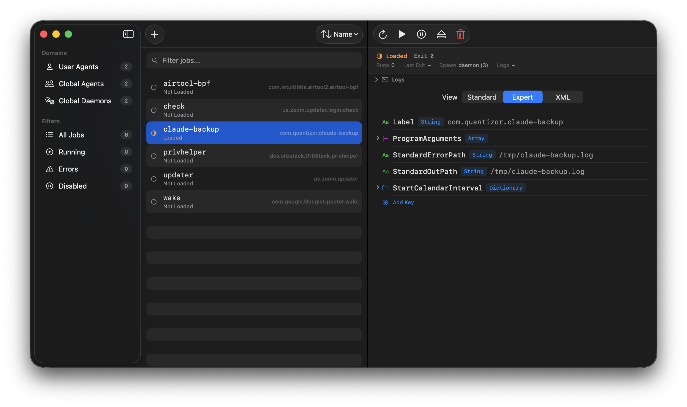

<p align="center">
  
</p>

<h1 align="center">Houston</h1>

<p align="center">Mission control for macOS launch daemons and agents. Free and open source.</p>

<p align="center">
  
</p>

## What it does

Browse, create, edit, and manage every launchd job on your Mac — user agents, global agents, and system daemons — from one window. Plist editor with validation. Touch ID for privileged operations.

## Requirements

macOS 26 (Tahoe) or later. Xcode 26+ to build from source.

## Get started

```
make install
```

Or open in Xcode:

```
make open
```

All commands: `make help`

## How it's built

Swift 6, SwiftUI, no external dependencies. One Xcode project with an embedded Swift package:

```
HoustonKit/
  Models             Data types
  LaunchdService     launchctl, plist I/O
  PrivilegedHelper   XPC client for /Library ops
  JobAnalyzer        Misconfiguration detection
  LogViewer          File tail + OSLog
  PlistEditor        Editor view models
```

## License

MIT — [Quantizor Ventures](https://quantizor.dev)
